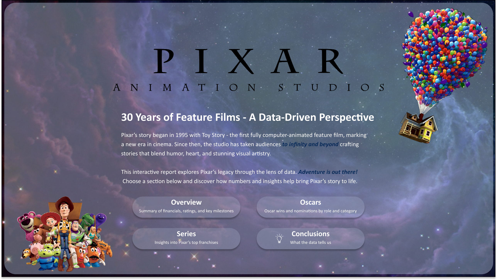
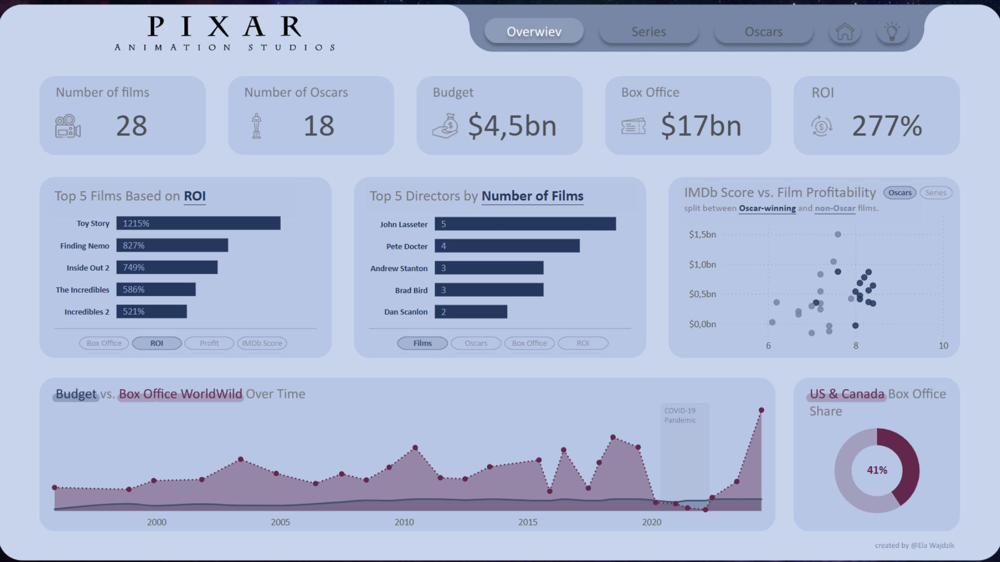
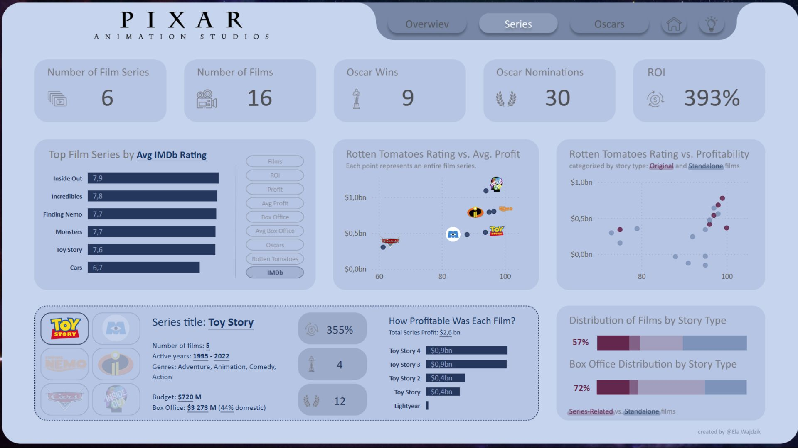
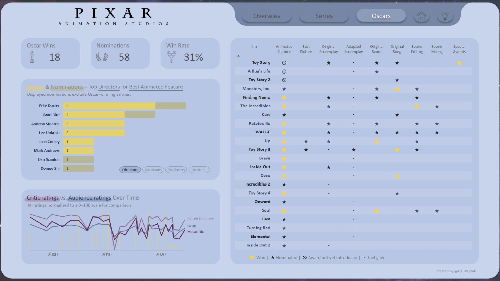
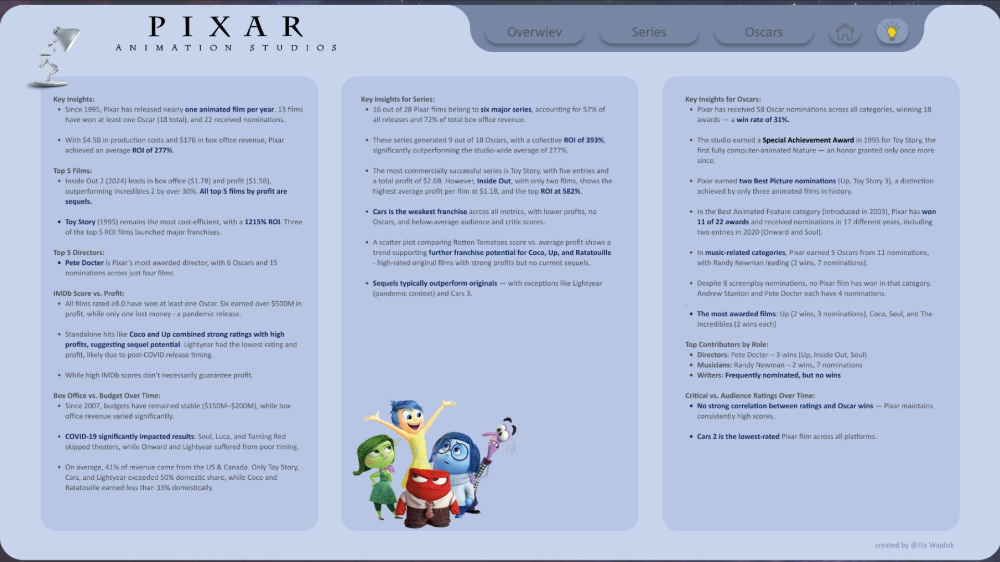

# Maven Pixar Challenge
Use data visualization and storytelling to showcase the legacy of Disney Pixar films over time.

    

  

  
  

 

  
  

  

## Objective
Analyze and showcase Pixar’s 30-year journey in animated filmmaking using interactive Power BI visuals. This report highlights how data can bring context to creativity - from box office success to storytelling excellence.

## Project Purpose
This report was developed as part of the Maven Pixar Challenge to combine data storytelling with analytical thinking. It explores the creative and commercial legacy of Pixar Animation Studios, using data to answer questions such as:

* How has Pixar’s success evolved over time?
* What impact did the COVID-19 pandemic have on its films?
* Which franchises became the studio’s biggest achievements?
* How often - and in what ways - has the Academy recognized Pixar’s work?

## Dataset & Data Preparation
The dataset included six structured CSV files covering:

* Financials (budgets, domestic/international/total box office)
* Film details (release date, rating, plot, genres)
* Contributor roles (directors, writers, musicians, producers)
* Audience & critic ratings (IMDb, Rotten Tomatoes, Metacritic)
* Oscar nominations and wins

Additional fields were manually created:

* Film series classification (series name, film type: original, sequel, prequel)
* Film posters used for dynamic tooltips

Minor corrections included estimating a missing budget, removing duplicate entries, and handling film titles containing commas (e.g., Monsters, Inc.).

## Data Cleaning & Transformation

The data required light but essential cleaning and modeling:

* Fixed missing values and duplicates
* Ensured reliable joins between tables via film titles
* Created calculated columns for: ROI, profit, story type, award metrics per role
* Developed dynamic DAX measures and parameters for interactivity:
    * Top N controls
    * Metric selectors (Profit, ROI, IMDb Score, etc.)
    * Role-based Oscar analysis 

Focus was placed on designing story-driven, context-aware visuals that invite exploration and comparison.

## Report Structure & Key Insights
The dashboard includes three core pages + a conclusions page:

* Overview - Summary KPIs (films, Oscars, box office, ROI), top 5 films/directors, scatter plots (IMDb vs. profit), and performance over time.
* Series - A deep dive into Pixar’s six major franchises vs. standalone films. This section highlights ROI, profitability, and the impact of sequels vs. originals.
* Oscars - Breakdown of wins and nominations by film, contributor role, and category. Includes audience vs. critic rating comparisons over time
* Conclusions - Key takeaways - combining visuals and narrative insights for broader context and final reflections.

## Interesting Insights & Conclusions

* Toy Story (1995) was the first fully computer-animated feature and earned a Special Achievement Award from the Academy - a rare honor.
* Pixar has dominated the Best Animated Feature category with 11 wins out of 22 since its introduction in 2003.
Up and Toy Story 3 received Best Picture nominations, a rare feat for animated films.
* Production budgets have remained consistent (mostly $150M–$200M) over nearly 20 years, suggesting strong cost control.
* Franchise films generate 72% of total box office - confirming the commercial strength of Pixar’s sequels and prequels.
* High-performing standalone films like Coco, Up, and Ratatouille show potential for future franchise expansion.
* Some Oscar-nominated films scored lower with audiences (Brave, Toy Story 4), while several highly rated titles (WALL-E, Soul) had modest profits - showing a nuanced balance between acclaim and revenue.
* This project highlights how data can bring depth to creative industries - uncovering patterns, supporting decisions, and telling new stories.

For final reflections, visit the “Conclusions” page in the report.

 

*** 

 # 
 Thank you for your attention! 🫶️
If you have any feedback or suggestions, feel free to reach out at ela.wajdzik@gmail.com or leave a comment below.